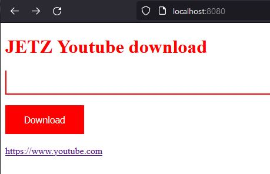

# Übung Youtube download mit Flask

**Bei dieser Übung geht es um ein Code-Beispiel welches es erlaubt,   Youtube Videos auf einer eigenen Website einzugeben und herunterzuladen.**

Für das herunterladen wird eine Bibliothek verwendet:  **youtube-dl**
https://github.com/ytdl-org/youtube-dl

Als erstes muss diese per pip installiert werden (im Terminal eingeben)

    $> pip install youtube-dl

## Python integration

Beispiele sind in der JupiterNotbook Datei ***Youtube-dl_Uebung.ipynb***

## Übung: 