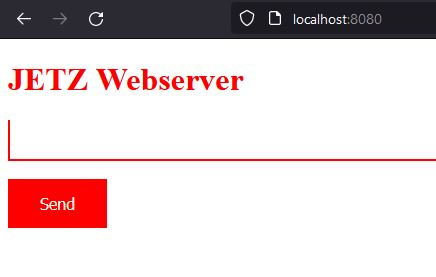

# JETZ Webserver mit Flask

Mit nur wenigen Zeilen Code kann mit dem einfachen Webserver Flask in Python eine interaktive Seite erzeugt werden.

In dem Eingabe-Textfeld könenn Befehle z.B. "Zeit" oder auch Sätze "Was ist für Zeit" eingegeben und an den Server übertragen werden. 
Dieser analysiert diese und kann beim finden eines Schlüsselwortes darauf anworten.